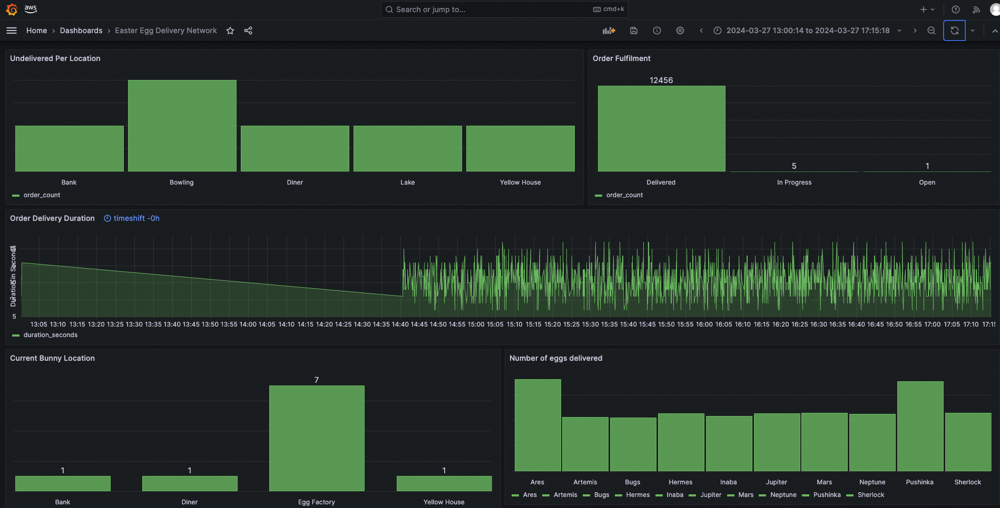
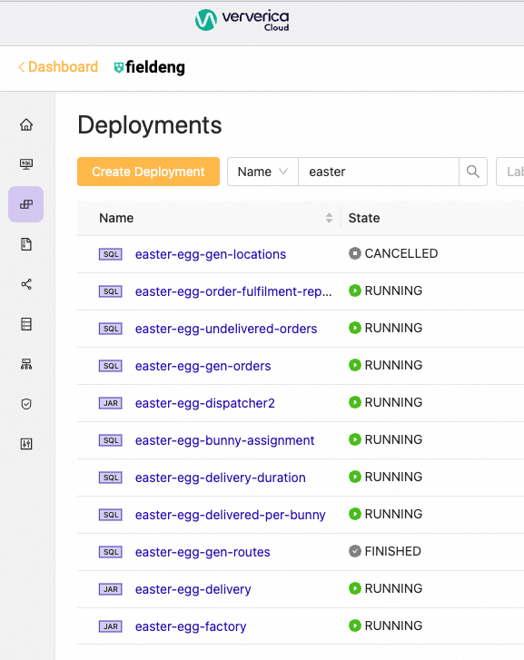

# Hop to it! Innovating Easter Egg Delivery with Ververica Cloud



This repository contains an example of Egg Delivery solution:

1. Flink SQL code for data preparation and monitoring
2. Flink DataStream Scala code for core solution
3. SQL DDL code for MySQL database

To build a JAR with all Flink jobs run:

```bash
sbt assembly
```

Once executed, find a JAR file in the target/scala folder.

